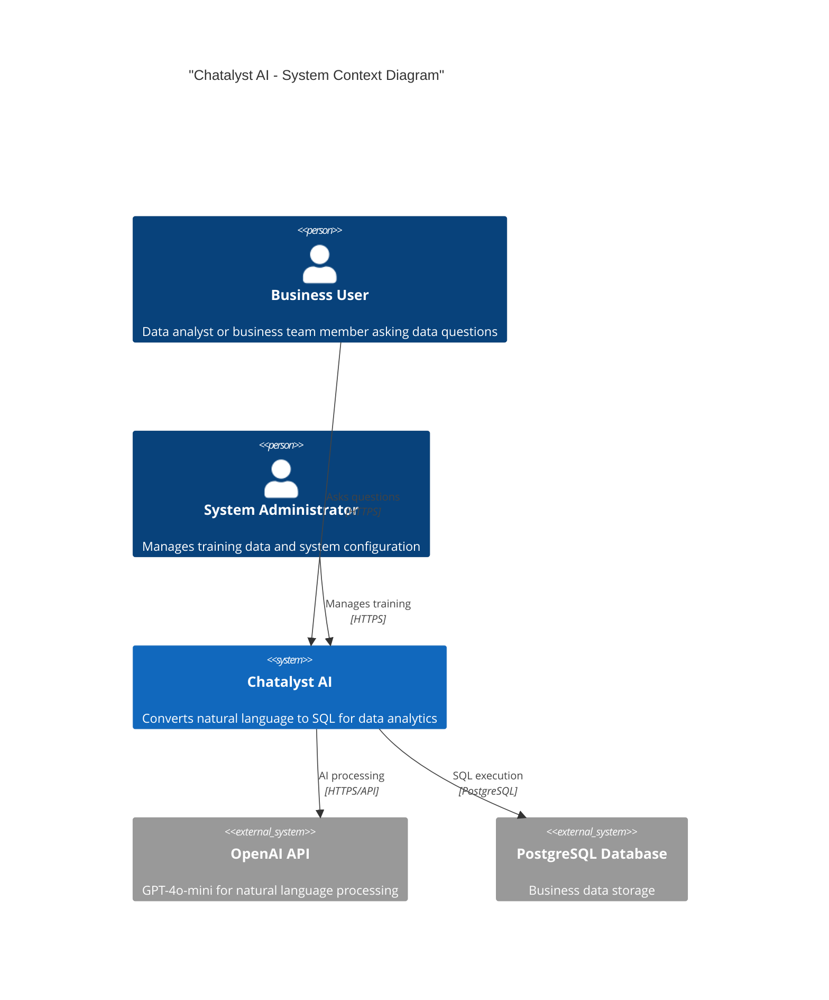
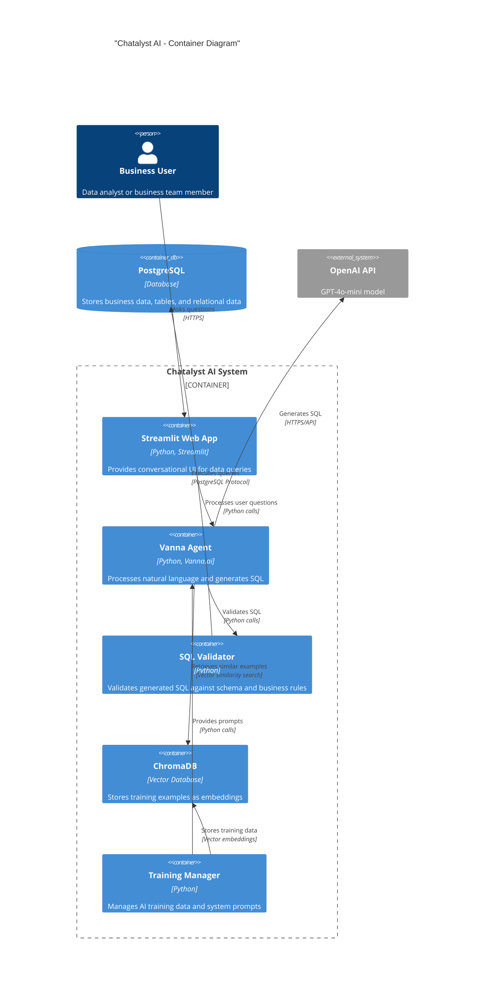
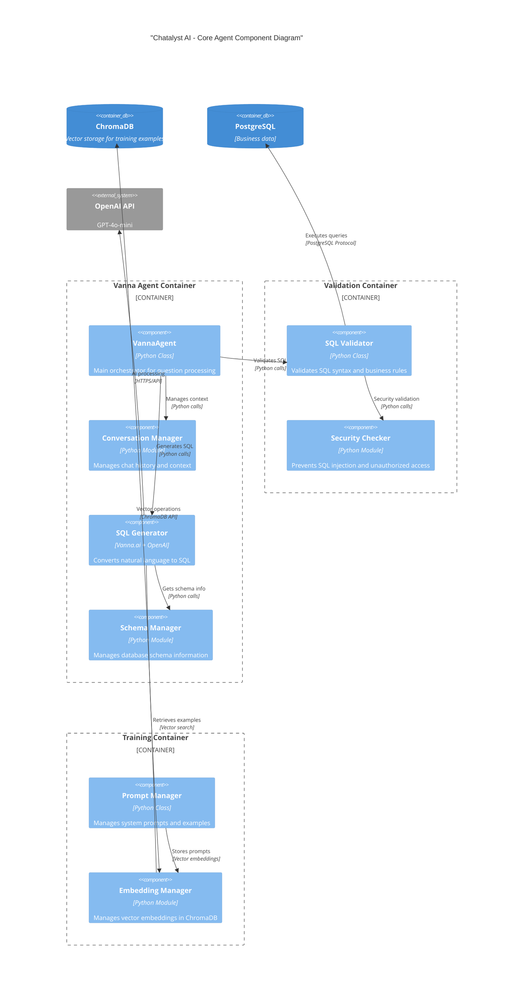

# Chatalyst AI - Technical Documentation

> **What This Project Does**  
> Chatalyst AI converts natural language questions into SQL queries for intelligent data analysis. Users ask questions in plain English, the system generates and executes SQL against any PostgreSQL database, and returns results in a conversational interface.

---

## 🏗️ **System Architecture Overview**

### **C4 Architecture Diagrams**

#### **System Context Diagram**


#### **Container Diagram**


#### **Component Diagram - Core Agent**


### **Core Technology Stack**
- **AI Engine**: Vanna.ai + OpenAI GPT-4o-mini
- **Vector Storage**: ChromaDB for embedding-based training data retrieval
- **Database**: PostgreSQL with dynamic schema discovery
- **Web Interface**: Streamlit with advanced session management
- **Deployment**: Docker containerization with production-ready configuration
- **Language**: Python 3.12+ with type hints and modern async patterns

### **Core Components**
1. **AI Agent** (`agent/`): Handles natural language to SQL conversion using Vanna.ai
2. **Database Layer** (`database/`): PostgreSQL connector and schema management
3. **Validation** (`validation/`): SQL query validation and security checks
4. **Training** (`training/`): Manages AI model training data and prompts
5. **UI** (`ui/`): Streamlit web interface for user interactions
6. **Configuration** (`config/`): Environment and deployment settings

---

## 🧠 **AI Engine Implementation**

### **Custom Vanna.ai Integration**
```python
class MyVanna(ChromaDB_VectorStore, OpenAI_Chat):
    """Custom Vanna class combining ChromaDB + OpenAI"""
```

**How It Works**:
- Uses ChromaDB to store training examples as vectors
- When user asks a question, retrieves similar examples via vector similarity
- Combines retrieved examples with database schema and current question
- Sends to OpenAI GPT-4o-mini to generate SQL
- Validates generated SQL against database schema before execution

### **Conversation Management**
```python
def _rewrite_question_with_context(self, question: str) -> str:
    """Leverages Vanna's generate_rewritten_question for context"""
```

**Implementation Details**:
- Stores conversation history in session state (max 20 entries)
- Uses Vanna's `generate_rewritten_question()` to incorporate context from previous questions
- Each user session is completely isolated from others
- Automatically cleans up old conversation entries to prevent memory growth

### **Training Data Pipeline**
**How Training Works**:
1. **Schema Loading**: Reads PostgreSQL schema and generates DDL statements
2. **Example Training**: Loads curated question-SQL pairs from `training_data/`
3. **Prompt Setup**: Configures system prompts for business domain knowledge
4. **Vector Storage**: Stores training examples in ChromaDB for similarity search

---

## 💾 **Database Architecture**

### **Dynamic Schema Discovery**
The system automatically discovers and adapts to any PostgreSQL database schema:

**Schema Discovery Process**:
- **Table Discovery**: Automatically identifies all tables and views
- **Column Analysis**: Analyzes column types, constraints, and relationships
- **Relationship Mapping**: Discovers foreign key relationships between tables
- **Index Optimization**: Identifies existing indexes for query optimization

**Adaptive Query Generation**:
```sql
-- System automatically adapts to your schema structure
-- Examples based on common business patterns:

-- Sales Analysis
SELECT category, SUM(amount) as total_sales 
FROM sales_table 
GROUP BY category 
ORDER BY total_sales DESC;

-- Customer Segmentation  
SELECT customer_segment, COUNT(*) as customer_count,
       AVG(order_value) as avg_order_value
FROM customers c
JOIN orders o ON c.customer_id = o.customer_id
GROUP BY customer_segment;

-- Time-based Analysis
SELECT DATE_TRUNC('month', created_at) as month,
       COUNT(*) as total_records
FROM your_table 
GROUP BY month 
ORDER BY month;
```

### **Database Connector Implementation**
```python
class PostgreSQLConnector:
    """Production-ready PostgreSQL connector with psycopg3"""
```

**Implementation Details**:
- Uses psycopg3 for PostgreSQL connections
- Automatically reconnects if connection drops
- Returns query results as pandas DataFrames
- All queries use parameterized statements (no SQL injection risk)
- Configurable read-only database permissions

---

## 🛡️ **Security & Validation**

### **Multi-Layer SQL Validation**
```python
class SQLValidator:
    """Validates generated SQL against discovered schema"""
```

**What It Validates**:
1. **Column Existence**: Checks if all columns in generated SQL actually exist in schema
2. **SQL Structure**: Ensures basic SQL syntax is valid
3. **Table Relationships**: Validates JOIN conditions and foreign key relationships
4. **Business Rules**: Configurable validation rules for your specific domain
5. **Data Privacy**: Prevents access to sensitive columns when configured

### **Access Control**
- **Configurable Authentication**: Supports various authentication methods
- **Session Management**: Each user gets isolated conversation history
- **Query Logging**: All queries and user actions are logged for audit
- **Permission Control**: Configurable database access permissions

---

## 🖥️ **User Interface Architecture**

### **Streamlit Implementation**
```python
def process_question(question: str):
    """Main conversation processing with caching"""
```

**UI Features**:
- **Chat Interface**: Question/answer format with conversation history
- **Query Caching**: Same questions return cached results (configurable TTL)
- **Schema Explorer**: Browse database schema and relationships
- **Query History**: View and reuse previous successful queries
- **Error Display**: Shows clear error messages when queries fail

### **Session Management**
**Technical Implementation**:
```python
def initialize_session_state():
    """Initialize session variables for conversation management"""
```

**How Sessions Work**:
- **Auto-save**: Conversations automatically saved to session state
- **Multiple Users**: Each browser session is completely independent
- **Conversation History**: Users can save, rename, and load previous conversations
- **Context Persistence**: Maintains conversation context across page reloads

---

## ⚡ **Performance Architecture**

### **Query Performance**
**Typical Query Response Time**:
1. **Simple SELECT queries**: ~1-2 seconds (basic table scans)
2. **Complex joins**: ~3-5 seconds (multi-table relationships)
3. **Large dataset aggregations**: ~5-10 seconds (depends on data volume)
4. **Schema discovery**: ~1-3 seconds (cached after first load)

### **Caching Strategy**
```python
@st.cache_data(ttl=300)  # 5-minute cache
def generate_sql_cached(question: str, context: str) -> str:
```

**What Gets Cached**:
- **SQL Generation**: Same questions return cached SQL for configurable time
- **Database Schema**: Schema information cached in memory
- **Training Embeddings**: Vector embeddings saved to disk in `data/vanna_embeddings/`
- **Query Results**: Frequently accessed data cached with TTL

---

## 🔧 **Configuration & Deployment**

### **Environment Management**
```python
# Environment-specific configuration loading
ENV = os.getenv("ENV", "development")
env_filename = ".env.prod" if ENV == "production" else ".env"
```

**Configuration System**:
- **Environment Files**: `.env` for dev, `.env.prod` for production, `.env.test` for testing
- **Environment Variables**: All secrets and settings via env vars
- **Model Settings**: OpenAI model, temperature, and other AI parameters configurable
- **Database Settings**: Flexible database connection configuration

### **Docker Deployment**
```dockerfile
FROM python:3.12-slim
# Production-optimized container with health checks
```

**Docker Setup**:
- **Single Container**: All components run in one container
- **Volume Mounts**: Data and logs persisted outside container
- **Port Mapping**: Streamlit runs on configurable port (default 8501)
- **Environment Config**: Uses environment-specific .env files
- **Health Checks**: Built-in container health monitoring

---

## 📊 **Business Intelligence Features**

### **Analytics Capabilities**
**Core Business Metrics Patterns**:
- **Revenue Analysis**: `SUM(amount)`, `AVG(order_value)`, revenue trends
- **Growth Calculations**: `(current_period - previous_period) / previous_period * 100`
- **Customer Metrics**: Customer lifetime value, retention rates, segmentation
- **Performance KPIs**: Conversion rates, engagement metrics, operational efficiency
- **Time-series Analysis**: Trends, seasonality, period-over-period comparisons

**Advanced Analytics Features**:
- **Dynamic Aggregations**: Automatic GROUP BY and aggregate function selection
- **Intelligent JOINs**: Discovers and uses table relationships automatically
- **Statistical Calculations**: Basic statistical functions and business calculations
- **Complex CTE Patterns**: Sophisticated SQL for multi-step analysis

### **Query Pattern Recognition** 
The system recognizes common business query patterns:

```sql
-- Revenue Analysis Pattern
SELECT period, SUM(revenue) as total_revenue
FROM sales_data
GROUP BY period
ORDER BY period;

-- Customer Segmentation Pattern  
SELECT segment, COUNT(*) as customers, AVG(value) as avg_value
FROM customer_data
GROUP BY segment;

-- Growth Analysis Pattern
WITH period_data AS (
  SELECT period, metric_value
  FROM business_metrics
)
SELECT period, 
       metric_value,
       LAG(metric_value) OVER (ORDER BY period) as previous_value
FROM period_data;
```

**Implementation Notes**:
- Pattern recognition adapts to your specific database schema
- Automatically suggests appropriate aggregations and groupings
- Handles time-based analysis with intelligent date/timestamp handling

---

## 🛠️ **Development & Maintenance**

### **Code Structure**
- **Type Hints**: All functions have comprehensive type annotations
- **Logging**: Uses Python logging module throughout
- **Error Handling**: Robust try-catch blocks with meaningful error messages
- **Documentation**: Key functions have detailed docstrings
- **Modular Design**: Clear separation of concerns across components

### **Testing & Debugging**
- **Schema Validation**: Comprehensive schema discovery and validation testing
- **Query Testing**: Automated testing of common query patterns
- **Integration Testing**: End-to-end testing of AI-to-database pipeline
- **Error Handling**: Comprehensive error scenarios covered
- **Performance Testing**: Query performance monitoring and optimization

### **Monitoring**
```python
logger.info(f"Query executed successfully, returned {len(df)} rows.")
```

**What Gets Logged**:
- **All SQL Queries**: Generated SQL and execution results
- **User Questions**: Original questions and processing steps
- **Schema Discovery**: Database schema analysis and caching
- **Errors**: Failed queries and validation errors with context
- **Performance**: Response times, cache hits, and system metrics

---

## 🔧 **Operations & Support**

### **How to Deploy**
```bash
# Development
streamlit run ui/streamlit_app.py

# Production with Docker
docker-compose up -d
```

**Required Environment Variables**:
- `VANNA_API_KEY`: OpenAI API key
- `POSTGRES_HOST`, `POSTGRES_USER`, `POSTGRES_PASSWORD`, `POSTGRES_DATABASE`: Database connection
- `VANNA_MODEL`: AI model to use (default: gpt-4o-mini)

### **Common Issues & Solutions**
1. **"No API Key" Error**: Set `VANNA_API_KEY` in environment variables
2. **Database Connection Failed**: Verify PostgreSQL connection settings and network access
3. **Slow SQL Generation**: Check if training data is loaded properly, consider adding domain-specific examples
4. **Schema Discovery Issues**: Ensure database user has proper permissions to read schema information
5. **Inaccurate Results**: Add training examples specific to your domain and data structure

---

## 📚 **Technical Documentation Structure**

### **File Structure**
```
chatalyst-ai/
├── agent/              # Core AI logic (VannaAgent class)
├── database/           # Database connection and schema management
├── validation/         # SQL validation and security
├── training/           # Training data and prompt management
├── training_data/      # Training examples and documentation
├── ui/                 # Streamlit web interface
├── config/             # Environment configuration
├── data/               # Vector embeddings storage
├── logs/               # Application logs
├── docker-compose.yml  # Docker deployment
└── requirements.txt    # Python dependencies
```

### **Key Files to Understand**
- **`agent/vanna_agent.py`**: Main AI agent that handles question processing
- **`ui/streamlit_app.py`**: Web interface and user interaction
- **`database/connector.py`**: PostgreSQL connection management
- **`validation/sql_validator.py`**: SQL validation logic
- **`training/prompt_manager.py`**: System prompts for AI
- **`config/settings.py`**: Environment and configuration management

---

## 🎯 **Summary**

Chatalyst AI is a production-ready text-to-SQL system that works with any PostgreSQL database. It uses Vanna.ai and OpenAI to convert natural language questions into SQL queries, with automatic schema discovery, conversation context, and comprehensive validation.

**What Works Well**:
- Generates accurate SQL for diverse business data queries
- Automatically adapts to any PostgreSQL database schema
- Maintains conversation context across multiple questions
- Comprehensive validation against database schema and security rules
- Production-ready deployment with Docker

**Current Capabilities**:
- **Universal Schema Support**: Works with any PostgreSQL database structure
- **Intelligent Query Generation**: Adapts to your specific business domain
- **Security-First Design**: Multi-layer validation and access control
- **Scalable Architecture**: Handles concurrent users and large datasets

**Good for**:
- Business teams who need quick data insights from PostgreSQL databases
- Data analysts who want to reduce time spent writing SQL queries
- Organizations looking to democratize data access
- Teams needing conversational data exploration capabilities

**Extensible Design**:
- Easy to add new database connectors
- Configurable training data for domain-specific optimization
- Modular architecture for custom business logic
- API-ready design for integration with existing systems

---

*Last Updated: January 2025* 